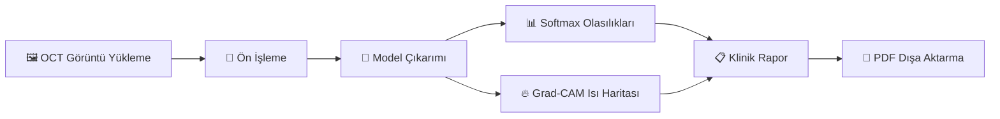

<p align="center">
  <h1 align="center">🧬 Retinal AMD Klinik Karar Destek Sistemi</h1>
  <p align="center">
    <strong>Yapay Zekâ Destekli Retinal OCT Patoloji Tespiti ve Klinik Raporlama Platformu</strong>
  </p>
  <p align="center">
    <a href="#özellikler"></a>
    <a href="#özellikler"></a>
    <a href="#özellikler"></a>
    <a href="#lisans"></a>
  </p>
</p>

---

## 📌 Genel Bakış

**Optik Koherens Tomografi (OCT)** görüntülerinden retinal patolojilerin tespitine yönelik derin öğrenme destekli **klinik karar destek sistemidir**. Sistem; **Yaşa Bağlı Makula Dejenerasyonu (AMD)**, **Diyabetik Makula Ödemi (DME)**, **Koroidal Neovaskülarizasyon (CNV)** ve **Drusen** patolojilerini yüksek doğrulukla sınıflandırır.

Platform, son teknoloji evrişimli sinir ağlarını **Gradient-weighted Class Activation Mapping (Grad-CAM)** ile birleştirerek model kararlarını görselleştirir, otomatik klinik raporlar üretir ve bunları indirilebilir PDF formatında sunar — tamamı Streamlit tabanlı premium bir web arayüzü üzerinden çalışır.

> ⚠️ **Sorumluluk Reddi**: Bu sistem klinik **karar destek** aracı olarak tasarlanmıştır. Tahminler yapay zekâ desteklidir ve kesin tanı niteliği taşımaz. Uzman hekim değerlendirmesi her zaman esastır.

---

## ✨ Özellikler

<table>
<tr>
<td width="50%">

### 🧠 Derin Öğrenme Modelleri
- **EfficientNet-B4** — Compound Scaling mimarisi ile 4 sınıflı OCT sınıflandırmada **%99+ doğruluk** (CNV, DME, DRUSEN, NORMAL)
- **Swin-V2 + SupCon** *(yakında)* — Supervised Contrastive Learning ile Vision Transformer, 3 sınıflı sınıflandırma (AMD, DME, NORMAL)

</td>
<td width="50%">

### 🔥 Açıklanabilir Yapay Zekâ (XAI)
- **Hook tabanlı Grad-CAM** — Saf PyTorch implementasyonu (sıfır harici bağımlılık)
- Hem **CNN** (4D tensör) hem **Transformer** (3D token) mimarilerini destekler
- **JET colormap** ile ısı haritası görselleştirmesi — patolojik bölgeleri vurgular

</td>
</tr>
<tr>
<td width="50%">

### 📋 Otomatik Klinik Raporlama
- **Türkçe** klinik analiz raporları — patolojiye özgü açıklamalar
- **Güven skoru** değerlendirmesi ve düşük güven uyarıları (<%70)
- AMD alt tip ayrımı için bağlamsal notlar (CNV vs. DRUSEN)

</td>
<td width="50%">

### 📄 PDF Dışa Aktarma
- **Profesyonel PDF raporları** — Unicode desteği (FPDF2)
- İçerik: orijinal görüntü, Grad-CAM overlay, olasılık dağılım tablosu ve klinik analiz
- Arşivleme için zaman damgalı dosya adları

</td>
</tr>
</table>

---

## 🏗️ Proje Mimarisi

```
retinal-amd-decision-support/
│
├── app.py                      # Ana Streamlit uygulaması
│                                 # Premium arayüz, çıkarım pipeline'ı, interaktif grafikler
│
├── models/
│   ├── __init__.py              # Model tanımları ve ağırlık yükleme
│   │                             # EfficientNet-B4, Swin-V2-B mimarileri
│   └── *.pth                    # Önceden eğitilmiş model ağırlıkları
│
├── utils/
│   ├── preprocessing.py         # Görüntü dönüşümleri (Resize → CenterCrop → Normalize)
│   ├── gradcam.py               # Hook tabanlı Grad-CAM (CNN & Transformer desteği)
│   ├── reporting.py             # Klinik rapor metni üretimi (Türkçe)
│   └── pdf_export.py            # Profesyonel PDF rapor üretimi
│
└── requirements.txt             # Python bağımlılıkları
```

### Sistem Pipeline'ı



---

## 🚀 Hızlı Başlangıç

### Gereksinimler

- **Python** 3.9+
- **pip** paket yöneticisi

### Kurulum

```bash
# Depoyu klonlayın
git clone https://github.com/<kullanici-adiniz>/retinal-amd-decision-support.git
cd retinal-amd-decision-support

# Sanal ortam oluşturun (önerilir)
python -m venv venv
source venv/bin/activate        # Linux/macOS
venv\Scripts\activate           # Windows

# Bağımlılıkları yükleyin
pip install -r requirements.txt
```

### Uygulamayı Çalıştırma

```bash
streamlit run app.py
```

Uygulama `http://localhost:8501` adresinde başlayacaktır.

---

## 🖥️ Kullanım

| Adım | İşlem | Açıklama |
|------|-------|----------|
| **1** | 📤 Görüntü Yükle | Yükleme alanından retinal OCT görüntüsü seçin (JPG/PNG) |
| **2** | 🧠 Model Seç | Kenar çubuğundan aktif modeli seçin *(EfficientNet-B4 aktif, Swin-V2 yakında)* |
| **3** | 🔬 Analiz Başlat | **"Analizi Başlat"** butonuna tıklayarak çıkarım + Grad-CAM işlemini tetikleyin |
| **4** | 📊 Sonuçları İncele | Tahmin, güven grafiği, Grad-CAM overlay ve klinik raporu inceleyin |
| **5** | 📄 PDF İndir | Analiz sonuçlarını profesyonel PDF raporu olarak indirin |

---

## 🧠 Modeller

### EfficientNet-B4 (Aktif)

| Özellik | Detay |
|---------|-------|
| **Mimari** | EfficientNet-B4 (Compound Scaling) |
| **Sınıflar** | CNV · DME · DRUSEN · NORMAL |
| **Giriş Boyutu** | 224 × 224 px |
| **Normalizasyon** | ImageNet (μ=[0.485, 0.456, 0.406], σ=[0.229, 0.224, 0.225]) |
| **Doğruluk** | Validasyon setinde **%99+** |
| **Grad-CAM Hedefi** | `model.features[-1]` (son özellik çıkarma bloğu) |

### Swin-V2-B + SupCon (Yakında)

| Özellik | Detay |
|---------|-------|
| **Mimari** | Swin Transformer V2-B (dondurulmuş omurga) |
| **Eğitim** | Supervised Contrastive Learning |
| **Sınıflar** | AMD · DME · NORMAL |
| **Not** | AMD sınıfı CNV + DRUSEN alt tiplerini birleştirir |
| **Grad-CAM Hedefi** | `model.norm` (normalizasyon katmanı) |

---

## 📦 Teknoloji Yığını

| Kategori | Teknoloji |
|----------|-----------|
| **Derin Öğrenme** | PyTorch, TorchVision |
| **Web Framework** | Streamlit |
| **Görselleştirme** | Plotly, OpenCV |
| **PDF Üretimi** | FPDF2 |
| **Görüntü İşleme** | Pillow, NumPy |

---

## ☁️ Dağıtım (Deployment)

### Streamlit Community Cloud (Önerilen)

1. Bu depoyu GitHub'a push'layın
2. [share.streamlit.io](https://share.streamlit.io) adresini ziyaret edin
3. GitHub hesabınızı bağlayın → Repoyu seçin → Deploy edin

> **Not**: Üretim dağıtımları için `requirements.txt` içindeki `opencv-python` paketini `opencv-python-headless` ile değiştirin ve sistem bağımlılıkları için bir `packages.txt` dosyası ekleyin.

### Docker

```dockerfile
FROM python:3.11-slim

WORKDIR /app
COPY . .

RUN apt-get update && apt-get install -y libgl1-mesa-glx libglib2.0-0 \
    && pip install --no-cache-dir -r requirements.txt

EXPOSE 8501
CMD ["streamlit", "run", "app.py", "--server.port=8501", "--server.address=0.0.0.0"]
```

---

## 🤝 Katkıda Bulunma

Katkılarınızı bekliyoruz! Pull Request göndermekten çekinmeyin.

1. Depoyu fork'layın
2. Feature branch'inizi oluşturun (`git checkout -b feature/harika-ozellik`)
3. Değişikliklerinizi commit'leyin (`git commit -m 'feat: harika özellik eklendi'`)
4. Branch'e push'layın (`git push origin feature/harika-ozellik`)
5. Pull Request açın

---

## 📄 Lisans

Bu proje MIT Lisansı altında lisanslanmıştır — detaylar için [LICENSE](LICENSE) dosyasına bakın.

---

<p align="center">
  <sub>Retinal tanı süreçlerini yapay zekâ ile ilerletmek için ❤️ ile geliştirilmiştir</sub>
</p>
