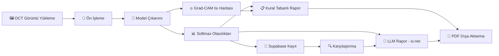
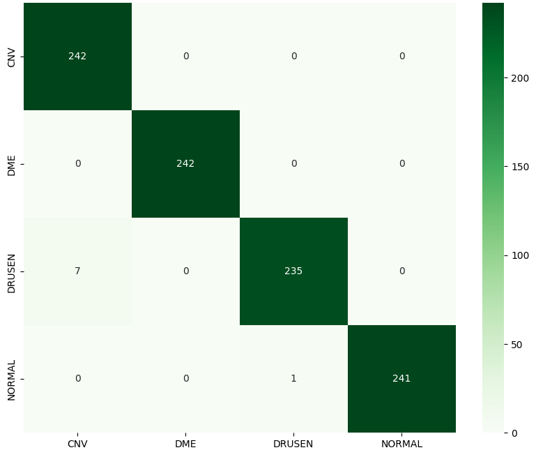
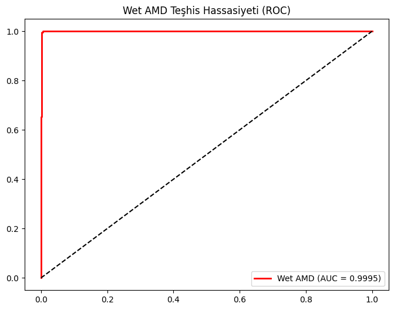
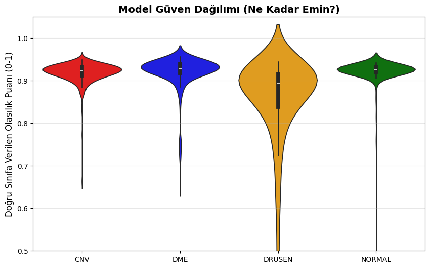
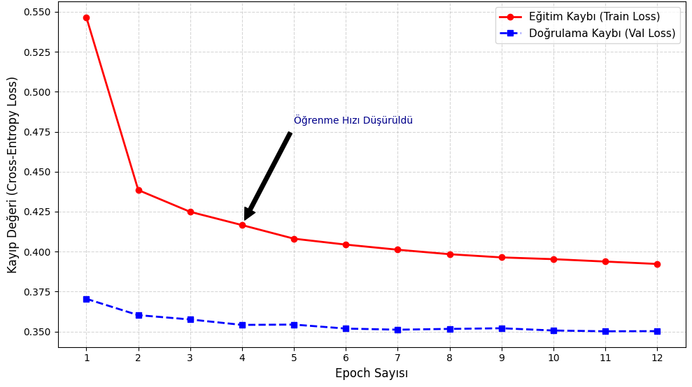
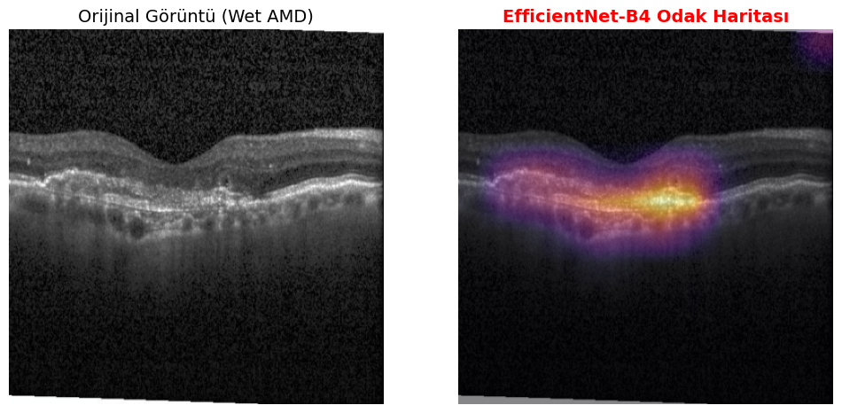

<p align="center">
  <h1 align="center">🧬 Retinal AMD Klinik Karar Destek Sistemi</h1>
  <p align="center">
    <strong>Yapay Zekâ Destekli Retinal OCT Patoloji Tespiti, Hasta Takibi ve LLM Klinik Raporlama Platformu</strong>
  </p>
  <p align="center">
    <a href="#özellikler"></a>
    <a href="#özellikler"></a>
    <a href="#özellikler"></a>
    <a href="#lisans"></a>
  </p>
</p>

---

## 📑 İçindekiler

- [📌 Genel Bakış](#-genel-bakış)
- [✨ Özellikler](#-özellikler)
- [🏗️ Proje Mimarisi](#️-proje-mimarisi)
- [🚀 Hızlı Başlangıç](#-hızlı-başlangıç)
- [🖥️ Kullanım](#️-kullanım)
- [🧠 Model Detayları](#-model-detayları)
- [📊 Model Performansı](#-model-performansı-efficientnet-b4)
- [📦 Teknoloji Yığını](#-teknoloji-yığını)
- [☁️ Dağıtım (Deployment)](#️-dağıtım-deployment)
- [🤝 Katkıda Bulunma](#-katkıda-bulunma)
- [📄 Lisans](#-lisans)

---

## 📌 Genel Bakış

**Optik Koherens Tomografi (OCT)** görüntülerinden retinal patolojilerin tespitine yönelik derin öğrenme destekli **klinik karar destek sistemidir**. Sistem; **Yaşa Bağlı Makula Dejenerasyonu (AMD)**, **Diyabetik Makula Ödemi (DME)**, **Koroidal Neovaskülarizasyon (CNV)** ve **Drusen** patolojilerini yüksek doğrulukla sınıflandırır.

Platform, son teknoloji evrişimli sinir ağlarını **Gradient-weighted Class Activation Mapping (Grad-CAM)** ile birleştirerek model kararlarını görselleştirir, **Supabase** veritabanı ile hasta takibi yapar, **io.net** üzerinden 18+ LLM modeli ile yapay zekâ destekli klinik raporlar üretir ve bunları indirilebilir PDF formatında sunar — tamamı Streamlit tabanlı premium bir web arayüzü üzerinden çalışır.

> ⚠️ **Sorumluluk Reddi**: Bu sistem klinik **karar destek** aracı olarak tasarlanmıştır. Tahminler yapay zekâ desteklidir ve kesin tanı niteliği taşımaz. Uzman hekim değerlendirmesi her zaman esastır.

---

## ✨ Özellikler

<table>
<tr>
<td width="50%">

### 🧠 Derin Öğrenme Modeli
- **EfficientNet-B4** — Compound Scaling mimarisi ile 4 sınıflı OCT sınıflandırmada **%99+ doğruluk** (CNV, DME, DRUSEN, NORMAL)

</td>
<td width="50%">

### 🔥 Açıklanabilir Yapay Zekâ (XAI)
- **Hook tabanlı Grad-CAM** — Saf PyTorch implementasyonu (sıfır harici bağımlılık)
- **CNN** (4D tensör) mimarisi için optimize edilmiş
- **JET colormap** ile ısı haritası görselleştirmesi — patolojik bölgeleri vurgular

</td>
</tr>
<tr>
<td width="50%">

### 📋 Otomatik Klinik Raporlama
- **Türkçe** klinik analiz raporları — patolojiye özgü açıklamalar
- **Güven skoru** değerlendirmesi ve düşük güven uyarıları (<%70)
- AMD alt tip ayrımı için bağlamsal notlar (CNV vs. DRUSEN)

</td>
<td width="50%">

### 📄 PDF Dışa Aktarma
- **Profesyonel PDF raporları** — Unicode desteği (FPDF2)
- İçerik: orijinal görüntü, Grad-CAM overlay, olasılık dağılım tablosu ve klinik analiz
- Arşivleme için zaman damgalı dosya adları

</td>
</tr>
<tr>
<td width="50%">

### 🏥 Hasta Yönetim Sistemi
- **Supabase** veritabanı ile hasta kayıt ve takip
- Hasta arama, ekleme ve profil yönetimi
- Geçmiş analizleri görüntüleme ve karşılaştırma
- Güven skoru trend grafikleri

</td>
<td width="50%">

### 🤖 LLM Destekli Akıllı Raporlama
- **io.net API** üzerinden **18+ LLM modeli** desteği
- DeepSeek-V3.2, Kimi-K2, Qwen3, Llama-4, Mistral ve daha fazlası
- Kullanıcı arayüzünden **model seçimi**
- Tekli analiz ve **karşılaştırmalı rapor** üretimi
- 120 saniyelik timeout ve detaylı loglama

</td>
</tr>
</table>

---

## 🏗️ Proje Mimarisi

```
retinal-amd-decision-support/
│
├── app.py                      # Ana Streamlit uygulaması (Analiz + Hasta Yönetimi)
│
├── models/
│   ├── __init__.py              # Model tanımları ve ağırlık yükleme (EfficientNet-B4)
│   └── sota_99acc.pth           # Önceden eğitilmiş model ağırlıkları
│
├── utils/
│   ├── preprocessing.py         # Görüntü dönüşümleri (Resize → CenterCrop → Normalize)
│   ├── gradcam.py               # Hook tabanlı Grad-CAM (CNN desteği)
│   ├── reporting.py             # Kural tabanlı klinik rapor üretimi (Türkçe)
│   ├── llm_reporting.py         # LLM destekli rapor üretimi (io.net, 18+ model)
│   ├── pdf_export.py            # Tekli ve karşılaştırmalı PDF rapor üretimi
│   ├── database.py              # Supabase veritabanı bağlantısı ve CRUD işlemleri
│   └── ui_components.py         # Yardımcı UI bileşenleri
│
├── .streamlit/
│   ├── secrets.toml             # API anahtarları (git'e dahil edilmez)
│   ├── secrets.toml.example     # Secrets şablon dosyası
│   └── config.toml              # Streamlit yapılandırması
│
├── assets/                      # Model performans görselleri
├── requirements.txt             # Python bağımlılıkları
└── packages.txt                 # Sistem bağımlılıkları (Streamlit Cloud)
```

### Sistem Pipeline'ı



---

## 🚀 Hızlı Başlangıç

### Gereksinimler

- **Python** 3.9+
- **pip** paket yöneticisi
- **Supabase** hesabı (hasta takibi için)
- **io.net** API anahtarı (LLM raporlama için)

### Kurulum

```bash
# Depoyu klonlayın
git clone https://github.com/<kullanici-adiniz>/retinal-amd-decision-support.git
cd retinal-amd-decision-support

# Sanal ortam oluşturun (önerilir)
python -m venv venv
source venv/bin/activate        # Linux/macOS
venv\Scripts\activate           # Windows

# Bağımlılıkları yükleyin
pip install -r requirements.txt
```

### Secrets Yapılandırması

`.streamlit/secrets.toml` dosyasını oluşturun (`.streamlit/secrets.toml.example` şablonunu referans alın):

```toml
[supabase]
url = "https://YOUR_PROJECT.supabase.co"
key = "YOUR_ANON_KEY"

[io_net]
api_key = "YOUR_IO_NET_API_KEY"
base_url = "https://api.intelligence.io.solutions/api/v1/"
model = "deepseek-ai/DeepSeek-V3.2"
```

> ⚠️ **Streamlit Cloud'da**: Settings → Secrets bölümünden aynı içeriği yapıştırın.

### Uygulamayı Çalıştırma

```bash
streamlit run app.py
```

Uygulama `http://localhost:8501` adresinde başlayacaktır.

---

## 🖥️ Kullanım

| Adım | İşlem | Açıklama |
|------|-------|----------|
| **1** | 🏥 Hasta Seç/Ekle | Hasta Yönetimi sekmesinden hasta seçin veya yeni hasta ekleyin |
| **2** | 📤 Görüntü Yükle | Yükleme alanından retinal OCT görüntüsü seçin (JPG/PNG) |
| **3** | 🔬 Analiz Başlat | **"🚀 Analiz Et"** butonuyla çıkarım + Grad-CAM işlemini başlatın |
| **4** | 📊 Sonuçları İncele | Tahmin, güven grafiği, Grad-CAM overlay ve klinik raporu inceleyin |
| **5** | 🤖 LLM Rapor | Dropdown'dan LLM modeli seçip **"Yapay Zekâ ile Detaylı Rapor Üret"** butonuna tıklayın |
| **6** | 🔍 Karşılaştır | Geçmiş analizlerden seçerek karşılaştırma yapın, LLM karşılaştırma raporu üretin |
| **7** | 📄 PDF İndir | Tekli veya karşılaştırmalı analizi PDF olarak indirin |

---

## 🧠 Model Detayları

### EfficientNet-B4

| Özellik | Detay |
|---------|-------|
| **Mimari** | EfficientNet-B4 (Compound Scaling) |
| **Sınıflar** | CNV · DME · DRUSEN · NORMAL |
| **Giriş Boyutu** | 224 × 224 px |
| **Normalizasyon** | ImageNet (μ=[0.485, 0.456, 0.406], σ=[0.229, 0.224, 0.225]) |
| **Doğruluk** | Validasyon setinde **%99.17** |
| **Grad-CAM Hedefi** | `model.features[-1]` (son özellik çıkarma bloğu) |

---

## 📊 Model Performansı (EfficientNet-B4)

### Eğitim Hiperparametreleri

| # | Parametre | Değer | Açıklama |
|---|-----------|-------|----------|
| 0 | **Model Mimarisi** | EfficientNet-B4 | Hassas doku analizi için yüksek kapasiteli model |
| 1 | **Giriş Çözünürlüğü** | 380 × 380 | Küçük retina lezyonlarını yakalamak için optimize edildi |
| 2 | **Batch Size** | 64 | A100 bellek kapasitesi için optimize edilmiş hacim |
| 3 | **Optimizer** | AdamW (Weight Decay: 1e-4) | Daha kararlı ağırlık güncellemeleri için |
| 4 | **Learning Rate (Başlangıç)** | 1e-4 | İnce detayları öğrenmek için düşük hız seçildi |
| 5 | **LR Scheduler** | ReduceLROnPlateau | Doğruluğa bağlı dinamik hız düşürme |
| 6 | **Loss Function** | Label Smoothing CrossEntropy (0.1) | Modelin genelleme yeteneğini artıran kayıp fonksiyonu |
| 7 | **Data Augmentation** | Horizontal/Vertical Flip, Rotation, ColorJitter | Farklı çekim koşulları simülasyonu |
| 8 | **Mixed Precision (AMP)** | Aktif (O1) | Eğitim hızını 2-3× artıran Tensor Core kullanımı |
| 9 | **Epoch Sayısı** | 12 | Modelin yakınsaması için belirlenen tam tur sayısı |

### Sınıflandırma Raporu

968 test görüntüsü üzerinde elde edilen sonuçlar:

| Sınıf | Precision | Recall | F1-Score | Destek |
|-------|-----------|--------|----------|--------|
| **CNV** | %97.19 | %100.00 | %98.57 | 242 |
| **DME** | %100.00 | %100.00 | %100.00 | 242 |
| **DRUSEN** | %99.58 | %97.11 | %98.33 | 242 |
| **NORMAL** | %100.00 | %99.59 | %99.79 | 242 |
| **Genel Doğruluk** | | | **%99.17** | **968** |

### Temel Bulgular

- 🏆 **%99.17 genel doğruluk** — 968 test görüntüsünden yalnızca **8 tanesi** yanlış sınıflandırıldı
- ✅ **DME sınıfı mükemmel** — Precision, Recall ve F1'in üçü de %100 (242/242 doğru)
- ✅ **CNV sınıfı %100 Recall** — Hiçbir CNV vakası kaçırılmadı (yüksek hassasiyet)
- ⚡ **DRUSEN en zayıf halka** — 7 DRUSEN örneği CNV olarak yanlış sınıflandırıldı (Recall: %97.11). Bu, iki patolojinin morfolojik benzerliğinden kaynaklanmaktadır
- 🎯 **Tüm AUC değerleri ≥ 0.9995** — Model, sınıflar arası ayrımda neredeyse ideal performans göstermektedir

### Performans Görselleri

<table>
<tr>
<td align="center" width="50%">

**Karışıklık Matrisi (Confusion Matrix)**

Modelin 968 test görüntüsü üzerindeki tahmin dağılımı. Köşegen üzerindeki yoğunluk, yüksek sınıflandırma başarısını gösterir.



</td>
<td align="center" width="50%">

**ROC Eğrisi & AUC Değerleri**

Tüm sınıflar için AUC ≥ 0.9995 — model neredeyse ideal ayırt edicilik göstermektedir.



</td>
</tr>
<tr>
<td align="center" width="50%">

**Model Güven Dağılımı (Violin Plot)**

Doğru tahminlerdeki güven skoru dağılımı. DME en yüksek ve en dar güven aralığına sahiptir.



</td>
<td align="center" width="50%">

**Eğitim Süreci — Kayıp (Loss) Analizi**

12 epoch boyunca train/validation loss eğrileri. 4. epoch'ta öğrenme hızı düşürülmüş, sürekli iyileşme gözlenmiştir.



</td>
</tr>
</table>

### Grad-CAM Görselleştirmesi

Modelin karar verirken odaklandığı retinal bölgelerin ısı haritası ile görselleştirilmesi:

<p align="center">

</p>

> Grad-CAM, modelin **hangi retinal katmanlara** odaklandığını göstererek klinisyenlere **şeffaf ve yorumlanabilir** bir karar destek mekanizması sunar.

---

## 📦 Teknoloji Yığını

| Kategori | Teknoloji |
|----------|-----------|
| **Derin Öğrenme** | PyTorch, TorchVision |
| **Web Framework** | Streamlit |
| **Veritabanı** | Supabase (PostgreSQL) |
| **LLM API** | io.net (OpenAI uyumlu endpoint) |
| **Desteklenen LLM'ler** | DeepSeek-V3.2, Kimi-K2, Qwen3, Llama-4, Mistral ve 13+ model |
| **Görselleştirme** | Plotly, OpenCV |
| **PDF Üretimi** | FPDF2 |
| **Görüntü İşleme** | Pillow, NumPy |

---

## ☁️ Dağıtım (Deployment)

### Streamlit Community Cloud (Önerilen)

1. Bu depoyu GitHub'a push'layın
2. [share.streamlit.io](https://share.streamlit.io) adresini ziyaret edin
3. GitHub hesabınızı bağlayın → Repoyu seçin → Deploy edin

> **Not**: Üretim dağıtımları için `requirements.txt` içindeki `opencv-python` paketini `opencv-python-headless` ile değiştirin ve sistem bağımlılıkları için bir `packages.txt` dosyası ekleyin.

### Docker

```dockerfile
FROM python:3.11-slim

WORKDIR /app
COPY . .

RUN apt-get update && apt-get install -y libgl1-mesa-glx libglib2.0-0 \
    && pip install --no-cache-dir -r requirements.txt

EXPOSE 8501
CMD ["streamlit", "run", "app.py", "--server.port=8501", "--server.address=0.0.0.0"]
```

---

## 🤝 Katkıda Bulunma

Katkılarınızı bekliyoruz! Pull Request göndermekten çekinmeyin.

1. Depoyu fork'layın
2. Feature branch'inizi oluşturun (`git checkout -b feature/harika-ozellik`)
3. Değişikliklerinizi commit'leyin (`git commit -m 'feat: harika özellik eklendi'`)
4. Branch'e push'layın (`git push origin feature/harika-ozellik`)
5. Pull Request açın

---

## 📄 Lisans

Bu proje MIT Lisansı altında lisanslanmıştır — detaylar için [LICENSE](LICENSE) dosyasına bakın.

---

<p align="center">
  <sub>Retinal tanı süreçlerini yapay zekâ ile ilerletmek için ❤️ ile geliştirilmiştir</sub>
</p>
